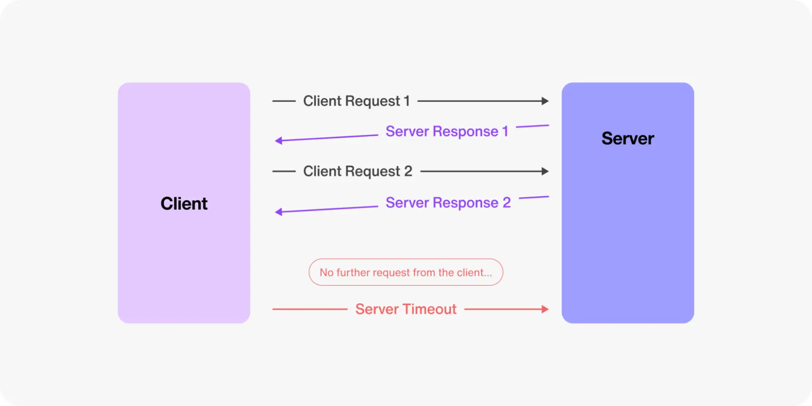

# **Prototype Long Polling**

**Long Polling** is a communication technique where the client sends a request to the server, which keeps the connection open until new data is available or a timeout occurs. Once the server responds, the client immediately sends a new request, creating a cycle that simulates real-time updates.



## 💻 General

### 🗃️ Repository

Clone the repository.

```bash
git clone git@github.com:tyronejosee/prototype_long_polling.git
```

## 🛠️ Backend

### ⚙️ Installation

Instalar las dependencias del proyecto.

```bash
poetry installgi
```

Ejecutar el entorno virtual.

```bash
poetry shell
```

Agregar una dependencia nueva.

```bash
poetry add <package-name>
```

Agregar dependencias de desarrollo (como linters o herramientas de prueba):

```bash
poetry add --group dev <package-name>
```

Ejecutar el proyecto.

```bash
python manage.py runserver
```

Run the migrations.

```bash
python manage.py migrate
```

Create a superuser to access the entire site without restrictions.

```bash
python manage.py createsuperuser
```

Log in to `admin`:

```bash
http://127.0.0.1:8000/admin/
```

## 🎨 Frontend

The front-end of the application was created with [Next.js](https://nextjs.org/) using the App Router introduced in Next.js 13 and the package manager [PNPM](https://pnpm.io/).

### ✅ Requirements

- [Node.js](https://nodejs.org/) >= 16.8.0
- [PNPM](https://pnpm.io/installation) >= 7.0

### ⚙️ Installation (Front-end)

To get started, make sure you have [PNPM](https://pnpm.io/installation) installed on your system. Then, follow these steps:

Navigate to the `frontend` folder:

```bash
cd ./frontend/
```

Install the dependencies:

```bash
pnpm install
```

### Available Scripts

Start the development server at `http://localhost:5173/`

```bash
pnpm dev
```

Enjoy! 🎉
